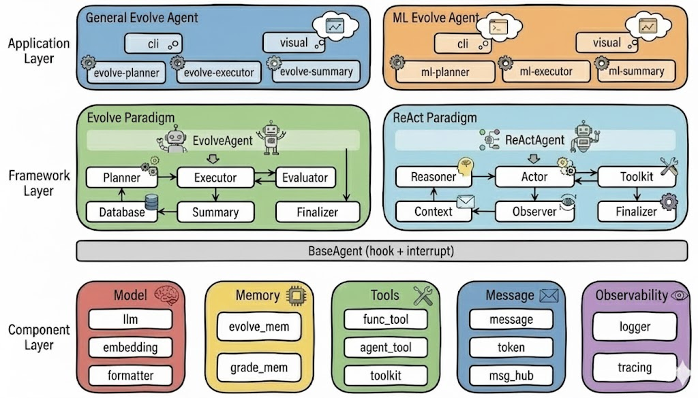

[**English Version**](./README.md)

<div align="center">

<h2 align="center">LoongFlow：会思考、会学习的专家级Agent开发框架</h2>

_让创造更自由！LoongFlow，让你的专家经验轻松转化为专业 AI 生产力。_

通过PES思考范式让Agent会思考、会学习，具备长程复杂推理能力，并且能够跳过局部最优，在迭代中积累经验实现专家级效果突破。

<p align="center">
    <a href="https://arxiv.org/abs/2512.24077">
        
    </a>
    <a href="https://pypi.org/project/LoongFlow/">
        
    </a>
    <a href="https://pypi.org/project/LoongFlow/">
        
    </a>
    <a href="./LICENSE">
        
    </a>       
</p>

[**General-Evolve**](./agents/general_evolve) • [**ML-Evolve**](./agents/ml_evolve) • [**EvolveAgent**](./src/evolux/evolve) • [**ReactAgent**](./src/evolux/react) • [**AgentSDK**](./src/agentsdk)

</div>

<br/>

<table align="center" width="100%" style="border: none; table-layout: fixed;">
<tr>

<td width="33%" align="center" style="vertical-align: top; padding: 20px;">
<div style="height: 60px; display: flex; align-items: center; justify-content: center;">
<h3 style="margin: 0; padding: 0;">🚀 <strong>General-Evolve</strong></h3>
</div>
<div align="center" style="margin: 10px 0;">
  
</div>
<div style="height: 60px; display: flex; align-items: center; justify-content: center;">
<p align="center"><strong>通用进化智能体</strong></p>
</div>
<div style="height: 120px; display: flex; align-items: center; justify-content: center;">
<p align="center"><strong>高效</strong>、<strong>稳定</strong>驱动通用算法设计和持续进化</p>
</div>
</td>

<td width="33%" align="center" style="vertical-align: top; padding: 20px;">
<div style="height: 60px; display: flex; align-items: center; justify-content: center;">
<h3 style="margin: 0; padding: 0;">🔥 <strong>ML-Evolve</strong></h3>
</div>
<div align="center" style="margin: 10px 0;">
  
</div>
<div style="height: 60px; display: flex; align-items: center; justify-content: center;">
<p align="center"><strong>机器学习智能体</strong></p>
</div>
<div style="height: 120px; display: flex; align-items: center; justify-content: center;">
<p align="center"><strong>全流程、全自主</strong>完整构建，持续进化突破</p>
</div>

</td>
<td width="33%" align="center" style="vertical-align: top; padding: 20px;">
<div style="height: 60px; display: flex; align-items: center; justify-content: center;">
<h3 style="margin: 0; padding: 0;">⭐ <strong>LoongFlow</strong></h3>
</div>
<div align="center" style="margin: 10px 0;">
  
</div>
<div style="height: 60px; display: flex; align-items: center; justify-content: center;">
<p align="center"><strong>通用Agent框架</strong></p>
</div>
<div style="height: 120px; display: flex; align-items: center; justify-content: center;">
<p align="center"><strong>会思考、会学习</strong>的专家级通用Agent开发框架</p>
</div>
</td>

</tr>
</table>

<br/>

**LoongFlow**：取名源自“龙场悟道”，寓意LoongFlow 致力于打破“知”与“行”的藩篱，让经验在知行合一中觉醒，让每一份专业积淀都能转化为强大的AI生产力。

## 📰 News

- **[2025-12]** 🎉 LoongFlow v1 has been released now!

## ✨ Why LoongFlow?

**会思考、会学习的专家级Agent开发框架，让Agent像科学家一样思考，助力开发者快速把自己的专业经验转化为专家级Agent。**

<p align="center">

</p>

- **会思考**：创新PES思考范式，让Agent具备结构化思考能力，解决长程复杂推理难题。让Agent可以像人类科学家一样，迭代解决高难度任务。

- **会学习**：创新多结构融合记忆，通过主动生成模型推理上下文，让Agent在任务迭代中，持续总结经验，越跑越好，实现轻量级学习进化。

- **专家级**：在通用进化和机器学习两个高难度场景验证。在陶哲轩&AlphaEvolve发布数学挑战中，有11个题目超过人类最好结果，并在7个问题上超过AlphaEvolve进化结果，取得最新SOTA；在MLE-bench评测集中40场kaggle机器学习赛事验证，取得22场金牌。同时相比传统方法，综合进化效率提升约60%。


我们认为，设计一个能解决复杂问题的专家级Agent，**关键就在于Agent的思考模式**，思考模式决定了这个Agent能解决问题的复杂度和效果上限。LoongFlow就是为解决需要长程思考的复杂任务而生，帮助开发者快速构建领域专家级效果Agent。


## 🚀 快速开始

### 安装

> LoongFlow requires **Python 3.12** or higher.

```bash
# Install uv/conda and clone repository
uv: https://docs.astral.sh/uv/getting-started/installation/
Miniforge: https://conda-forge.org/download/

# Install with uv
cd LoongFlow
uv venv .venv --python 3.12
source .venv/bin/activate
uv pip install -e .

# Install with conda
cd LoongFlow
conda create -n loongflow python=3.12
conda activate loongflow
pip install -e .

```

### 运行示例

#### Run General Evolve Agent

```bash
# Config LLM: Edit task_config.yaml, recommend to use gemini-3-pro-preview or deepseek-r1-250528
# Example: ./agents/general_evolve/examples/packing_circle_in_unit_square/task_config.yaml
# The model needs to configure providers as needed, default provider is openai. for example: openai/gemini-3-pro-preview
llm_config:
  url: "https://xxxxxx/v1"
  api_key: "******"
  model: "openai/gemini-3-pro-preview"

# Run your first evolve task, the evolution results are in the ./output directory
uv pip install -r ./agents/general_evolve/examples/packing_circle_in_unit_square/requirements.txt
./run_task.sh packing_circle_in_unit_square --background

# Check task log
tail -f ./agents/general_evolve/examples/packing_circle_in_unit_square/run.log

# Stop task
./run_task.sh stop packing_circle_in_unit_square

```

#### Run ML Evolve Agent

```bash
# Config LLM: Edit task_config.yaml, recommend to use gemini-3-pro-preview or deepseek-r1-250528
# Example: ./agents/ml_evolve/examples/ml_example/task_config.yaml
# The model needs to configure providers as needed, default provider is openai. for example: openai/gemini-3-pro-preview
llm_config:
  url: "https://xxxxxx/v1"
  api_key: "******"
  model: "openai/gemini-3-pro-preview"

# Init ml evolve
./run_ml.sh init

# Run your first evolve task, the evolution results are in the ./output directory
# ./run_ml.sh run <task_name> [--background] [other Python args]
./run_ml.sh run ml_example --background

# Check task log
tail -f ./agents/ml_evolve/examples/ml_example/agent.log

# Stop task
./run_ml.sh stop ml_example

```

## 🌟 评估效果

#### 陶哲轩&AlphaEvolve发布数学挑战

| Problem                           | Previously best known    |     AlphaEvolve      | LoongFlow Evolve Result |     Details     |
| --------------------------------- | -----------------------  | -------------------- | ----------------------- | --------------- |
| Circle packing in a square        | 2.634 (Higher is Better) |  2.6358627564136983  |  **2.6359829624734026** | [packing_circle_in_unit_square](./agents/general_evolve/examples/packing_circle_in_unit_square)               |
| Circle packing in a rectangle     | 2.364 (Higher is Better) |  2.3658321334167627  |  **2.365832229500823**  | [packing_circle_in_rectangle](./agents/general_evolve/examples/packing_circle_in_rectangle)                   |
| Packing hexagons in hexagons      | 3.943 (Lower is Better)  |  3.930092            |  **3.928906855463712**  | [packing_hexagons_in_hexagons](./agents/general_evolve/examples/packing_hexagons_in_hexagons)                 |
| Max to min ratios                 | 12.89（Lower is Better） |  12.88926611203463   |  **12.889243547212832** | [max_to_min_ratios](./agents/general_evolve/examples/max_to_min_ratios)                                       |
| Minimum Overlap Problem           | 0.380927 (Lower is Better) |  0.380924      | **0.3809137564083654**    | [minimum_overlap_problem](./agents/general_evolve/examples/minimum_overlap_problem)                           |
| An uncertainty inequality         | 0.3523 (Lower is Better)   |  0.35209910442252773  |  **0.352099104421844**   | [uncertainty_inequality](./agents/general_evolve/examples/uncertainty_inequality)                             |
| Second autocorrelation inequality | 0.88922 (Higher is Better) |  0.8962799441554083   | **0.9027021077220739**  | [second_autocorrelation_inequality](./agents/general_evolve/examples/second_autocorrelation_inequality)       |
| First autocorrelation inequality  | 1.5098 (Lower is Better)   |  1.5052939684401607   |  1.509527314861778   | [first_autocorrelation_inequality](./agents/general_evolve/examples/first_autocorrelation_inequality)         |
| Sums differences problems         | 1.059793 (Higher is Better) | 1.1219357374860444   |  1.103534711409646   | [sums_and_differences_problems_1](./agents/general_evolve/examples/sums_and_differences_problems_1)           |
| heilbronn triangles               | 0.036（Higher is Better）|  0.036529889880030156  | 0.0365298898793351    | [heilbronn_problem_for_triangles](./agents/general_evolve/examples/heilbronn_problem_for_triangles)           |
| heilbronn convex regions          | 0.0306（Higher is Better） |  0.030936889034895654  | 0.030900663674639613   | [heilbronn_problem_for_convex_regions](./agents/general_evolve/examples/heilbronn_problem_for_convex_regions) |

在11个几何和代数问题挑战中，取得了超过已知最好结果，并在7个问题上超过AlphaEvolve进化结果，取得最新SOTA。

#### Kaggle机器学习竞赛

| Problem                                  | LoongFlow Evolve Result | Details   |  Description  |
| ---------------------------------------- | ----------------------- | --------- | ------------- |
| aerial-cactus-identification             | 🥇 Gold                 | [aerial-cactus-identification](./agents/ml_evolve/examples/mlebench/competitions/simple/aerial-cactus-identification) | 用无人机拍的照片，识别图片里有没有仙人掌，目标是训练AI自动找到沙漠里的仙人掌。 |
| denoising-dirty-documents                | 🥇 Gold                 | [denoising-dirty-documents](./agents/ml_evolve/examples/mlebench/competitions/simple/denoising-dirty-documents) | 把发黄、有污渍的老旧文件照片清理干净，目标是让扫描后的文字清晰可读。 |
| detecting-insults-in-social-commentary   | 🥇 Gold                 | [detecting-insults-in-social-commentary](./agents/ml_evolve/examples/mlebench/competitions/simple/detecting-insults-in-social-commentary) | 识别社交媒体评论里有没有骂人的话，目标是自动过滤网络暴力内容。 |
| dogs-vs-cats-redux-kernels-edition       | 🥇 Gold                 | [dogs-vs-cats-redux-kernels-edition](./agents/ml_evolve/examples/mlebench/competitions/simple/dogs-vs-cats-redux-kernels-edition) | 分类任务，把狗猫图片判别出来，目标是区分图片里是狗还是猫。 |
| histopathologic-cancer-detection         | 🥇 Gold                 | [histopathologic-cancer-detection](./agents/ml_evolve/examples/mlebench/competitions/simple/histopathologic-cancer-detection) | 用AI看病理切片，判断有没有癌细胞，目标是帮助医生更快更准地诊断癌症。|
| nomad2018-predict-transparent-conductors | 🥇 Gold                 | [nomad2018-predict-transparent-conductors](./agents/ml_evolve/examples/mlebench/competitions/simple/nomad2018-predict-transparent-conductors) | 预测新材料能不能当透明导体用，目标是找到能导电又透明的材料，做手机屏幕、太阳能板啥的。 |
| plant-pathology-2020-fgvc7               | 🥇 Gold                 | [plant-pathology-2020-fgvc7](./agents/ml_evolve/examples/mlebench/competitions/simple/plant-pathology-2020-fgvc7) | 看苹果叶子照片，判断是健康还是有病，目标是帮农民及时发现病害，减少损失。 |
| tabular-playground-series-dec-2021       | 🥇 Gold                 | [tabular-playground-series-dec-2021](./agents/ml_evolve/examples/mlebench/competitions/simple/tabular-playground-series-dec-2021) | 给一堆数据，预测结果，这是Kaggle的入门练习赛，目标是练手学数据科学。 |
| the-icml-2013-whale-challenge-right-whale-redux   | 🥇 Gold        | [the-icml-2013-whale-challenge-right-whale-redux](./agents/ml_evolve/examples/mlebench/competitions/simple/the-icml-2013-whale-challenge-right-whale-redux) | 看鲸鱼照片，认出是哪条鲸鱼，目标是保护濒危的露脊鲸。 |
| google-quest-challenge          | 🥇 Gold                 | [google-quest-challenge](./agents/ml_evolve/examples/mlebench/competitions/medium/google-quest-challenge) | 给问答内容打标签，判断问题好坏和答案相关性，目标是提升问答系统的质量。 |
| plant-pathology-2021-fgvc8      | 🥇 Gold                 | [plant-pathology-2021-fgvc8](./agents/ml_evolve/examples/mlebench/competitions/medium/plant-pathology-2021-fgvc8) | 通过苹果叶子照片判断有没有病害，目标是帮助农民及时发现植物疾病。 |
| us-patent-phrase-to-phrase-matching     | 🥇 Gold                 | [us-patent-phrase-to-phrase-matching](./agents/ml_evolve/examples/mlebench/competitions/medium/us-patent-phrase-to-phrase-matching) | 判断两个专利短语的相似程度，目标是帮助专利审查员快速找到相关专利文件。 |
| predict-volcanic-eruptions-ingv-oe      | 🥇 Gold                 | [predict-volcanic-eruptions-ingv-oe](./agents/ml_evolve/examples/mlebench/competitions/hard/predict-volcanic-eruptions-ingv-oe) | 分析火山传感器数据预测火山喷发时间，目标是帮助提前预警减少灾害损失。 |
| stanford-covid-vaccine                  | 🥇 Gold                 | [stanford-covid-vaccine](./agents/ml_evolve/examples/mlebench/competitions/hard/stanford-covid-vaccine) | 预测RNA疫苗的稳定性，目标是设计出更稳定的新冠mRNA疫苗。 |

在MLE-bench评测集中40场kaggle机器学习赛事验证，已取得22个金牌，完整结果将在完成全部赛事后公布。

#### 其他尝试

另外在[数学谜题](./agents/general_evolve/examples/math_flip)，[MOE负载均衡](./agents/general_evolve/examples/moe_lb)等问题上验证，具体可在[Examples](./agents/general_evolve/examples)查看。

## 🧩 高级使用

#### EvolveAgent

```python
from evolux.evolve import EvolveAgent

# Config evolve agent
agent = EvolveAgent(
    config=config,
    checkpoint_path=checkpoint_path,
)

# Register worker（Implement the Planner, Executor, and Summary interfaces）
agent.register_planner_worker("planner", PlanAgent)
agent.register_executor_worker("executor", ExecuteAgent)
agent.register_summary_worker("summary", SummaryAgent)

# Run agent
result = await agent()
```

For more details, please refer to [EvolveAgent](./src/evolux/evolve)

#### ReActAgent

```python
from evolux.react import AgentContext, ReActAgent
from agentsdk.tools import TodoReadTool, TodoWriteTool, Toolkit

# Build agent context
toolkit = Toolkit()
toolkit.register_tool(TodoReadTool())
toolkit.register_tool(TodoWriteTool())

# Build default react agent
agent = ReActAgent.create_default(model=model, sys_prompt=sys_prompt, toolkit=toolkit)

# Run agent
result = await agent(message)
```

For more details, please refer to [ReActAgent](./src/evolux/react)

## 🤝 贡献

请阅读 [CONTRIBUTING.md](./CONTRIBUTING.md) 文件，了解行为准则以及提交拉取请求的流程。

## 💬 讨论

欢迎加入我们的社区进行讨论：

| [Discord](https://discord.gg/YSfdrC8HJh)       | Wechat                                                                 |
|------------------------------------------------|------------------------------------------------------------------------|
|  |  |

## 📜 许可

LoongFlow 采用 Apache License 2.0 许可。


## 📚 引用

如果您觉得我们的工作对您有帮助，请考虑引用我们的论文：

```bibtex
@misc{LoongFlow2025,
      title={LoongFlow: Directed Evolutionary Search via a Cognitive Plan-Execute-Summarize Paradigm}, 
      author={Chunhui Wan and Xunan Dai and Zhuo Wang and Minglei Li and Yanpeng Wang and Yinan Mao and Yu Lan and Zhiwen Xiao},
      year={2025},
      eprint={2512.24077},
      archivePrefix={arXiv},
      primaryClass={cs.AI},
      url={https://arxiv.org/abs/2512.24077}, 
}
```
